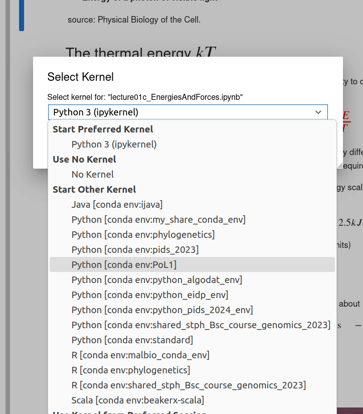

# Using the UniBas jupyer hub

SciCore, the high performance computing center, is providing a jupyter environment for teaching. You should be able to access it via

[jupyterhub-edu.scicore.unibas.ch/](https://jupyterhub-edu.scicore.unibas.ch/)

where you should see a login screen that looks like this


Your UniBas credentials should work, but you have to use the UniBas VPN.

## Finding PoL1 course materials

In the left side-panel, navigate to `teacher_data/Richard_Neher/PoL1-course-materials/notebooks/`. You can select any of the notebooks there and double click to open.


Before you can run the notebook, you need to select a "Kernel". The kernel is the computing environment needed to run the code in the notebook. Once you click on the button in the top right (might say "No Kernel", or "ipykernel"), a dialog will open where you can select the PoL1 kernel.




(The default ipykernel will work for most notebooks, but some libraries are missing.)

### Copying the notebooks

In the `teacher_data`, the notebooks are read-only. But you can use `Save as` to save a copy of the notebook in your home directory.

Alternatively, you can use the copy all of the notebooks into your home directory by opening the so-called "Terminal" and running a copy-command. You can find the Terminal button at the bottom in the "Launcher":


Once the terminal opened, type
```
cp -r teacher_data/Richard_Neher/PoL1-course-materials/notebooks PoL1-notebooks
```
This will create a copy of all the notebooks in the directory `PoL1-notebooks`.

Note that notebooks might change over the course of the semester and that more notebooks will be added. In this case, you will need to rerun the copy command.

## Creating a new notebook

To create a new notebook, use the Lauchner and select the kernel PoL1:


You can also upload a file or notebook.


